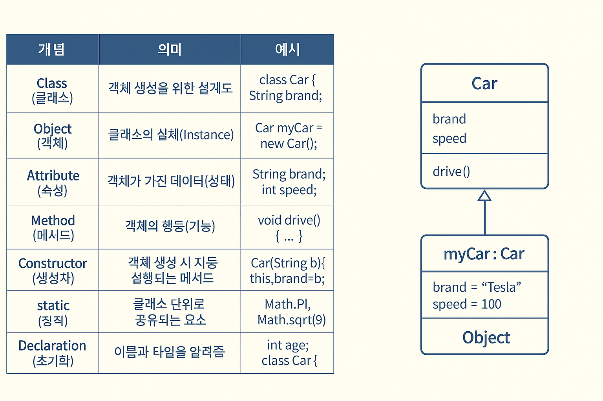

---

# 🎯 최상욱 | 실전형 Java 개발자 포트폴리오

> 완벽보다는 완성을 향해
> **기초 문법부터 객체지향, 실전 프로젝트까지 책임지는 개발자**
> 단순히 코드를 작성하는 수준을 넘어
> **자료구조와 알고리즘 기반의 문제 해결 능력**,
> **객체지향 원리(OOP)와 디자인 패턴 적용 경험**으로
> **현업에서 바로 활용 가능한 개발 역량**을 키워왔습니다.

* 💡 **문법 암기보다는 개념 이해**를 바탕으로, 문제 해결에 필요한 최적의 코드 작성
* 🧠 **자료구조, 알고리즘, JVM 메모리 구조 등 CS 핵심 지식**을 Java에 적용
* 🤝 **프로젝트 단위 협업 경험**과 **Git·GitHub**을 통한 코드 관리 능력 보유
* 🚀 **에러와 예외 처리 중심의 트러블슈팅 경험**으로 서비스 품질 개선

> “Java는 언어일 뿐, 중요한 건 문제 해결 능력”
> **최상욱은 현업에 바로 기여할 수 있는 Java 실무형 개발자입니다.**

---

## 📞 Contact & Links

| 이름         | 최상욱                                                                                             |
| ---------- | ----------------------------------------------------------------------------------------------- |
| **이메일**    | [gforce74@naver.com](mailto:gforce74@naver.com)                                                 |
| **GitHub** | [https://github.com/swc2074/fullstack\_20250825](https://github.com/swc2074/fullstack_20250825) |
| **포트폴리오**  | Java 기반 학습 & 프로젝트 기록                                                                            |

---

## 🚀 Golds (핵심 성과)

* Java의 **기초 문법부터 객체지향(OOP)까지 완전 정복**
* 예외 처리, 컬렉션 프레임워크 등 **실무 핵심 기능 실습 경험**
* GitHub와 연계하여 **프로젝트 관리 및 협업 경험 확보**
* **문제 발생 시 스스로 해결하는 트러블슈팅 역량**을 체득

---

## ✔ 기술스택 기반 CS 역량

| 🔧 기술스택          | 💡 CS 기반 이해 및 활용 능력 강조                                                                                           |
| ---------------- | ---------------------------------------------------------------------------------------------------------------- |
| **Java**         | JVM 메모리 구조(Heap, Stack, GC)를 이해하고 코드 효율성을 고려한 작성 가능. <br> OOP(캡슐화·상속·다형성)와 디자인 패턴을 실무 코드에 적용.                    |
| **자료구조/알고리즘**    | Array, LinkedList, Stack, Queue, HashMap 등 Java Collection 활용. <br> 시간복잡도(Big-O)를 고려한 효율적 문제 해결 능력.              |
| **예외 처리**        | Checked/Unchecked Exception 구분 및 `try-catch-finally`, `throw/throws`를 활용한 안정적 프로그램 설계.                           |
| **입출력 (I/O)**    | Java I/O Stream, NIO 이해 및 파일 처리 구현 가능. <br> Buffer와 Stream의 차이를 구조적으로 이해.                                        |
| **멀티스레드**        | Thread, Runnable, ExecutorService를 활용해 동시성 제어 경험. <br> 동기화(`synchronized`, `volatile`)를 통한 Race Condition 해결 경험. |
| **Git & GitHub** | 분산 버전 관리 시스템 이해 및 브랜치 전략(Git Flow) 적용. <br> 협업을 위한 Pull Request·Merge Conflict 해결 능력 보유.                         |

---

## 🥕 포트폴리오

### 📂 Java 실습 프로젝트 & 트러블슈팅

---

🛠️ 트러블슈팅 (1) — `NullPointerException` 발생

```java
public class ArrayEx {
    public static void main(String[] args) {
        String[] names = new String[5];
        System.out.println(names[0].length()); // ❌ NPE 발생
    }
}
```

#### 1. ❌ 문제점

* `names[0]`은 초기화되지 않은 상태(null)인데 `.length()` 호출 → **NullPointerException** 발생

#### 2. ✅ 해결방안

```java
names[0] = "아이언맨";
System.out.println(names[0].length()); // 정상 출력
```

#### 3. 💡 느낀점

* Java 배열은 **선언 시 null 값으로 초기화**된다는 점을 이해.
* 객체 사용 전 반드시 **초기화 여부 확인 습관** 필요.

---

🛠️ 트러블슈팅 (2) — `IndexOutOfBoundsException` 발생

```java
int[] scores = {100, 90, 80};
System.out.println(scores[3]); // ❌ 존재하지 않는 인덱스
```

#### 1. ❌ 문제점

* 배열 크기(3) 이상 인덱스 접근 시 예외 발생.

#### 2. ✅ 해결방안

```java
for (int i = 0; i < scores.length; i++) {
    System.out.println(scores[i]);
}
```

#### 3. 💡 느낀점

* 배열은 **고정 크기** 자료구조 → 크기 변경이 필요한 경우 **ArrayList 사용 고려**.
* `scores.length`를 습관적으로 활용해야 안정적인 코드 작성 가능.

---

🛠️ 트러블슈팅 (3) — Git + Java 프로젝트 충돌

```bash
$ git pull origin master
Auto-merging Student.java
CONFLICT (content): Merge conflict in Student.java
```

#### 1. ❌ 문제점

* 동일한 클래스(Student.java)를 여러 명이 수정하여 충돌 발생.

#### 2. ✅ 해결방안

* 충돌 구간(`<<<<<<<`, `=======`, `>>>>>>>`) 확인 후 필요한 코드만 남기고 수정.
* 이후 `git add` + `git commit`으로 병합 마무리.

#### 3. 💡 느낀점

* Java 프로젝트 협업에서는 **코딩 컨벤션과 역할 분담**이 중요.
* Git 충돌은 단순히 병합 문제가 아니라, **팀 협업 프로세스 문제**와 직결됨.


🛠️ 트러블슈팅 (4) —  Java Method 개념 이해 부족으로 처리 구역에 연산자 미기입


#### 1. ❌ 문제점

* 캐릭터타입 결과 값 미출력 발생.


#### 2. ✅ 해결방안

* type = process_type(avg); //6. 타입 main에 기입 후 처리 하기와 같이 결과 값 출력됨


#### 3. 💡 느낀점

* Java 프로그램에서  **변수, 입력, 처리, 출력 부에 정확한 기입**이 중요.
* 프로젝트 작성시 미기입내용 없는지 필히 **재검토하여 프로세스 문제** 없도록 주의해야함.

>🎆 실습 프로젝트 (1) — BANK 자동실행

|항목|주소|
| -| - |
| **동영상**    | [JAVA: BANK 실행 동영상](https://www.youtube.com/shorts/2_Y0fLX-7sI?feature=share)                                                 |

>🎆 실습 프로젝트 (2) — BANK 응용 고객 정보관리 실행

|항목|주소|
| -| - |
| **동영상**    | [JAVA: 고객정보 관리](https://youtube.com/shorts/FLiBGtLUTfI?feature=share)                                                 |
>🎆 실습 프로젝트 (3) — BANK Array 응용 고객 정보관리 실행

|항목|주소|
| -| - |
| **동영상**    | [JAVA: Array 적용 고객정보 관리](https://youtu.be/5e8G03Gjxk0)                                                 |


> 추가 기능 
> 개선 프로젝트
```
🎁Bank 관련 업무
---

```java
package com.company.java005_ex; 
import java.util.Scanner;

public class Bank_ver4_sam3_String3_check_f {
   public static void main(String[] args) {
      // =====================================================
      // 🏦 Mini Bank v4 - 실무 확장 아이디어 주석 추가
      // =====================================================
      // ✔ 콘셉트: "내 손안의 작은 은행"
      // - ID/PASS 기반 보안 처리
      // - CRUD(추가, 조회, 입금, 출금, 삭제) 기본 기능 제공
      // - 제어문/반복문/switch문을 활용한 실무형 흐름 제어
      // - 향후 확장 아이디어:
      //    ▸ 다중 사용자 계정 관리
      //    ▸ 거래내역 로그 기록 (ArrayList/파일 입출력 확장 가능)
      //    ▸ 이자율 자동 계산 기능 (잔액 * 금리)
      //    ▸ 출금 시 수수료 부과 (조건문 활용)
      //    ▸ 관리자 모드 (총 계정 수 / 은행 총 보유액 조회)
      //
      // 🎯 차별 포인트:
      //    단순 은행 시뮬레이터가 아닌
      //    "실제 서비스로 확장 가능한 설계 감각"을 보여주는 프로젝트
      // =====================================================
      
      // 변수
      int num = -1; 
      String id = "", pass="";  
      double balance=0;
      Scanner scanner = new Scanner(System.in);
      
      // 입력+처리+출력
      for(;;){  
          // ■ 기능 1. 메뉴판
          // 👉 향후: "관리자 모드" (비밀 번호 입력 시 은행 전체 현황 확인) 추가 가능
          System.out.print("\n\n== BANK ==" + 
             "\n1. 추가" + "\n2. 조회" + "\n3. 입금" + "\n4. 출금" + "\n5. 삭제" + 
             "\n9. 종료 > "     
          );  
          num= scanner.nextInt();
          
          // ■ 기능 2. 종료 조건
          if(num==9){ 
             System.out.println("종료합니다.");  
             break;   
          }
          // ■ 기능 3. 계정 추가
          else if(num==1){ 
             System.out.print("ID   입력 > "); id=scanner.next();
             System.out.print("PASS 입력 > "); pass=scanner.next();
             System.out.print("금액  입력 > "); balance=scanner.nextDouble();    
             System.out.println("✨ 신규 계좌 개설 완료!");
          }
          // ■ 기능 4. (조회/입금/출금/삭제) 실행 시 계정 인증 필요
          else if(num==2 || num==3|| num==4|| num==5){ 
             // 1. 사용자 인증
             System.out.print("ID   입력 > "); String tempId=scanner.next();
             System.out.print("PASS 입력 > "); String tempPass=scanner.next();
             if( !(id.equals(tempId)  && pass.equals(tempPass) )) {
                System.out.println("🚨 아이디와 비밀번호를 확인해주세요!");
                continue; // 인증 실패 → 메뉴로 돌아감
             }
             
             // 2. 2,3,4,5 각각에 해당하는 처리
             switch(num){
                case 2 : 
                   System.out.println("\n[계좌 조회]");
                   System.out.println("ID > "+id + "\n잔액 > "+ balance + " 원"); 
                   // 👉 아이디어: 최근 거래 내역 출력(향후 ArrayList로 기록)
                break;
                case 3 : 
                   System.out.print("입금할 금액 > ");  
                   double input = scanner.nextDouble();
                   balance +=input;  
                   System.out.println("💰 "+input+" 원 입금 완료! 현재 잔액: "+balance+" 원");
                   // 👉 아이디어: 특정 금액 이상 입금 시 "우대금리 쿠폰" 지급
                break;
                case 4 : 
                   System.out.print("출금할 금액 > ");  
                   double output = scanner.nextDouble();
                   if(output>balance) { 
                      System.out.println("⚠️ 잔액이 모자랍니다.");  
                      continue; 
                   }
                   balance -=output;  
                   System.out.println("💸 "+output+" 원 출금 완료! 현재 잔액: "+balance+" 원"); 
                   // 👉 아이디어: 출금 시 수수료(예: 500원) 자동 차감 기능 확장 가능
                break;
                case 5 : 
                   System.out.println("정말 삭제하시겠습니까? (y/n)");  
                   String answer = scanner.next();  
                   if(!answer.toLowerCase().equals("y")) {
                      System.out.println("삭제를 취소했습니다."); 
                      continue;
                   }
                   id=pass=""; balance=0;
                   System.out.println("🔥 계정 삭제 완료!");
                   // 👉 아이디어: 실제라면 DB에서도 데이터 영구 삭제 or 복구 기능 고려
                break;
             }
         } // end else if
           
      }// end for 
   }// end main
}//end class
```
```
### ✨ Java 실습 정리


🛒 java  OOP 핵심 개념 
---
* 개념 이해 필요



---

## 📌 참고문헌

* [Java 공식 문서](https://docs.oracle.com/javase/8/docs/)
* [Effective Java (Joshua Bloch)](https://www.oreilly.com/library/view/effective-java-3rd/9780134686097/)
* [Git 공식 문서](https://git-scm.com/doc)

---


